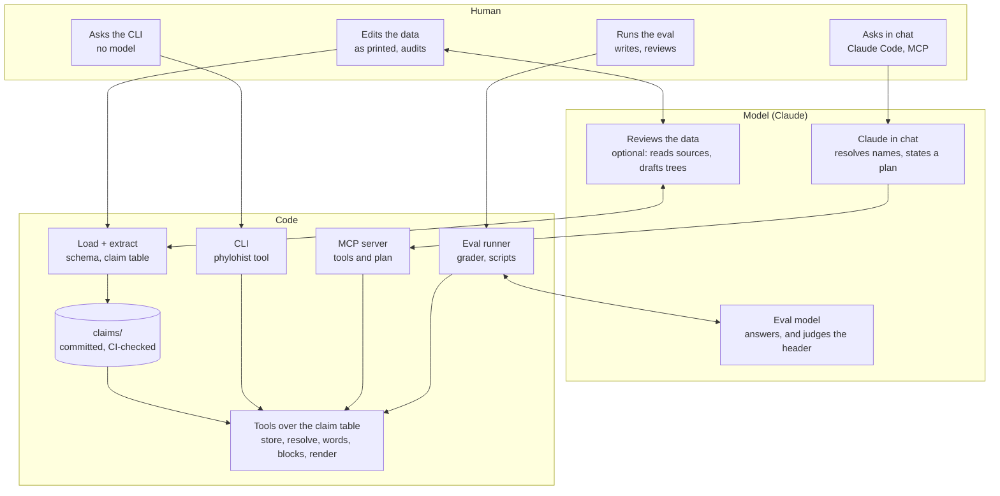

# Phylogenetic Research Tools

Science is always in motion.  Most online taxonomy or phylogeny
databases attempt to show a consensus or accepted view, with
each site having its own editorial policy for what gets included.

The `phylohist` project instead provides access to trees as published,
over time, while leaving the judgement of what to accept or reject to
the researcher.  An LLM-driven interface supports complex queries over
a curated corpus stored as YAML data.  This uses a model where one is
needed, and prioritizes reliability, reproducibility, speed,
and lower costs where one is not.

The current corpus includes information from 218 papers from the
1734 to the present, mostly focusing on Paleozoic echinoderms.
A coverage system tracks how much of the information from a paper has
been entered and reviewed.

**Please note:** This project began as a hobby, which is where the loader
code came from.  Further work has been done with the assistance of
Claude Code, focusing on edrioblastoids (including rhenopyrgids and
cyathocysids) as the primary proof of concept data set.

Next steps include writing human-user-friendly documentation,
continuing to improve the software development methodology, and publishing
the package as well as curating additional data and adding more features.

Work to incorporate specimens and geologic time scales is ongoing, but
currently handled in several different experimental ways while a final
design is determined.

## Humans, Models, and Code

The internet has made a tremendous amount of information available,
but finding what you need and verifying its accuracy is a lot of work.
Humans have the deepest judgement for data curation, while models
handle flexible querying beyond what fixed database queries can provide.
Underneath it all, deterministic code ensures fast, repeatable, and
accurate outcomes.

This table shows the roles of humans (the top row), models (the middle)
and code.  The third column shows the expected typical interactive usage,
where the model interprets the questions and chooses the tools to call and
output shapes to render, but leaves the querying and output construction
to code.

This avoids verbose or hallucinated output while spending tokens only
on the work that really requires a model's reasoning and flexibility.



- **The data.** The curator records each publication's opinions as
  printed. The model's part is optional and reviewable: it reads a
  paper against its tree and writes a review (`notes/reviews/`), or
  drafts a tree (`drafts/`) that code validates and the researcher
  audits before it enters `data/`. The human and the model review each
  other's work; code checks both against the schema and regenerates the
  claim table, which CI keeps current.
- **The CLI.** A question goes from the researcher to the tools with no
  model in the lane: `phylohist history rhenopyrgus` renders the block.
- **Chat.** Claude asks the MCP server. The model resolves the
  names and papers the question mentions and states a plan, the blocks
  the answer is made of; code builds and renders them. The model
  chooses; code answers. The only words of the model's own that reach a
  reader are a one-line header stating the parameters it chose.
- **The eval.** The runner drives the model over the committed
  questions in compose or planner mode, the grader is code, and a model
  judges only the header. The researcher writes the questions and
  reviews the grades and write-ups (`eval/`).

## Correctness, Performance, and Cost

The project's evolution can be seen through the evaluation
[metrics](eval/findings/metrics.md).

Moving from AI-written prose answers to planned queries with modular
output blocks improved key measurements across complete evaluation runs:

* Correctness rose from 61% to 87%, with several failure modes
  eliminated entirely.
* Wall clock time was cut from around 25 minutes to around 10 minutes.
* Token usage dropped from 2.25 million to 0.56 million

Future improvements to how the model selects blocks are expected to raise
the correctness score.

## Tools and MCP

The `phylohist` CLI runs queries over the claims table generated from
the curated YAML data.  These result in output data blocks rendered
as text, Markdown, or JSON based on the `--style` argument.

The CLI has one subcommand per tool:

```
    poetry run phylohist resolve "Palæaster"
    poetry run phylohist contents 1994_guensburg_sprinkle astrocystitidae --synonymy
    poetry run phylohist descendants edrioblastoidea
    poetry run phylohist ancestors astrocystitidae cyathocystidae rhenopyrgidae
    poetry run phylohist history rhenopyrgus --style markdown
    poetry run phylohist history "Rhenopyrgus grayae"
    poetry run phylohist under rhenopyrgus edrioblastoidina
    poetry run phylohist statements "Rhenopyrgus viviani"
    poetry run phylohist gap "Holloway & Jell 1983" material
    poetry run phylohist source "Lamarck 1816"
    poetry run phylohist plan my-plan.yaml
    poetry run python scripts/eval_run.py --mode planner --ask "Who first placed Rhenopyrgus under Edrioblastoidina?"
```

The same tools are served over MCP by
`scripts/mcp_server.py`, which `.mcp.json` registers for Claude Code:
a chat model can read blocks or state a plan and get the rendered answer.
The "Reading the table" section of `docs/claims.md` describes the blocks
and the tools.

The `eval_run.py` script can be used to ask a question without using the
chat interface to see how the model plans the queries and selects the output
blocks.  It requires an Anthropic API key to be configured.

```
    poetry run python scripts/eval_run.py --ask "Who first placed Rhenopyrgus under Edrioblastoidina?"
```

## Install

Python 3.10 or later and [Poetry](https://python-poetry.org/):

    poetry install

Only `scripts/eval_run.py` and the grader's `--judge` call a model;
they read `ANTHROPIC_API_KEY` from the environment or from a
git-ignored `.env` at the repository root. Nothing else needs a key.

## Checks

CI runs these on Python 3.10 and 3.14 and fails if the generated
schema census or claim table is stale:

    poetry run ruff check .
    poetry run ruff format --check .
    poetry run pytest --cov=phylohist --cov-fail-under=90
    poetry run python scripts/schema_audit.py --markdown scripts/schema-usage.md
    poetry run python scripts/claims.py
    git diff --exit-code scripts/schema-usage.md claims/
    poetry run python scripts/check_draft.py drafts/<file>.yaml

## Where things are

* `docs/` will contain user documentation; for now it explains how
  recorded tree data is converted to the claims that the tools use,
  as well as the tools and the answer formats.
* `notes/` contains project development information from both the human
  and LLM developers; some of this information might be out-of-date.
* `eval/` holds the evaluation questions, results, write-ups, and metrics.
* `drafts/` holds AI-drafted trees awaiting a human audit.

## Licence

`LICENSE` (MIT) covers the code. The YAML under `data/` is the owner's
compilation of published opinions, recorded as printed, and `notes/`
is the owner's and the assistant's writing.
