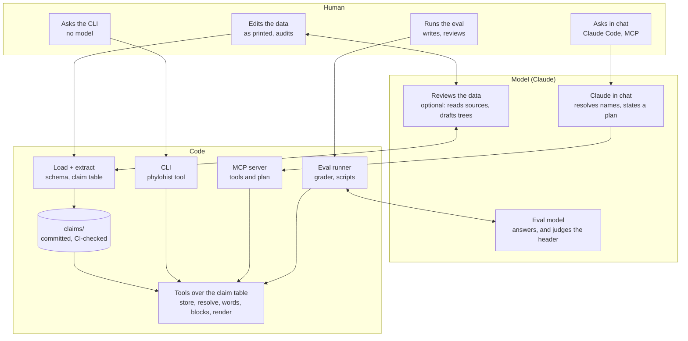

# Phylogenetic History Tools

Hand-edited YAML capturing taxonomic opinions as published (`data/`), a
loader with integrity checks (`phylohist/loader/`), and a generated claim table
(`claims/`, one JSONL per source plus a coverage manifest; see
`docs/claims.md`).

## How it fits together

Three lanes, human, model and code. Each column is one story, read
top to bottom; every surface in the code lane sits on the same tools
over the claim table, so the CLI, the MCP server and the eval cannot
disagree about an answer.

- **The data.** The researcher records each publication's opinions as
  printed. The model's part is optional and reviewable: it reads a
  paper against its tree and writes a review (`notes/reviews/`), or
  drafts a tree (`drafts/`) that code validates and the researcher
  audits before it enters `data/`. The human and the model review each
  other's work; code checks both against the schema and regenerates the
  claim table, which CI keeps current.
- **The CLI.** A question goes from the researcher to the tools with no
  model in the lane: `phylohist history rhenopyrgus` renders the block.
- **Chat.** Claude Code asks the MCP server. The model resolves the
  names and papers the question mentions and states a plan, the blocks
  the answer is made of; code builds and renders them. The model
  chooses; code answers. The only words of the model's own that reach a
  reader are a one-line header stating the parameters it chose.
- **The eval.** The runner drives the model over the committed
  questions in compose or planner mode, the grader is code, and a model
  judges only the header. The researcher writes the questions and
  reviews the grades and write-ups (`eval/`, `notes/evals/`).

## Install

Python 3.10 or later and [Poetry](https://python-poetry.org/):

    poetry install

Only `scripts/eval_run.py` and the grader's `--judge` call a model;
they read `ANTHROPIC_API_KEY` from the environment or from a
git-ignored `.env` at the repository root. Nothing else needs a key.

## Checks

CI runs these on Python 3.10 and 3.14 and fails if the generated
schema census or claim table is stale:

    poetry run ruff check .
    poetry run ruff format --check .
    poetry run pytest --cov=phylohist --cov-fail-under=90
    poetry run python scripts/schema_audit.py --markdown scripts/schema-usage.md
    poetry run python scripts/claims.py
    git diff --exit-code scripts/schema-usage.md claims/
    poetry run python scripts/check_draft.py drafts/<file>.yaml

The read-only tools over the claim table (`phylohist/tools.py`, over the
store in `store.py` with `resolve.py` and `words.py`) return blocks,
rendered in a style; the CLI has one subcommand per tool:

    poetry run phylohist resolve "Palæaster"
    poetry run phylohist contents 1994_guensburg_sprinkle astrocystitidae --synonymy
    poetry run phylohist descendants edrioblastoidea
    poetry run phylohist ancestors astrocystitidae cyathocystidae rhenopyrgidae
    poetry run phylohist history rhenopyrgus --style markdown
    poetry run phylohist history "Rhenopyrgus grayae"
    poetry run phylohist under rhenopyrgus edrioblastoidina
    poetry run phylohist statements "Rhenopyrgus viviani"
    poetry run phylohist gap "Holloway & Jell 1983" material
    poetry run phylohist source "Lamarck 1816"
    poetry run phylohist plan my-plan.yaml
    poetry run python scripts/eval_run.py --mode planner --ask "Who first placed Rhenopyrgus under Edrioblastoidina?"
    poetry run python scripts/eval_run.py --ask "Who first placed Rhenopyrgus under Edrioblastoidina?"

The same tools, and `plan`, are served over MCP by
`scripts/mcp_server.py`, which `.mcp.json` registers for Claude Code:
a chat model can read blocks or state a plan and get the rendered answer. `docs/claims.md`, "Reading the
table", describes the blocks and the tools.

## Where things are

`docs/` explains phylohist to a researcher who wants to use it:
`docs/claims.md` is the claim table, the closures over it, the tools
and the answer shapes. `notes/` is the development record, for anyone
interested in how the project was built: design notes, plans, audits,
per-paper reviews, eval write-ups, and notes on and translations of
individual papers (`notes/README.md` is the index). `eval/` holds the
questions, the prompt and the committed runs; `drafts/` holds
AI-drafted trees awaiting a human audit; `scripts/schema-usage.md` is
the generated schema census CI keeps current.

## Licence

`LICENSE` (MIT) covers the code. The YAML under `data/` is the owner's
compilation of published opinions, recorded as printed, and `notes/`
is the owner's and the assistant's writing.
